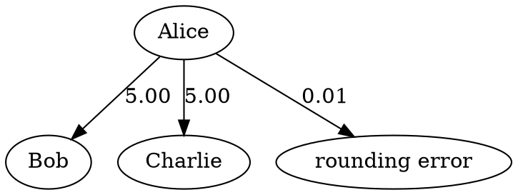

# calc-split

A simple command line tool to calculate how much each person owes in a group of friends.

## Setup

```bash
pdm install
```

## Usage

```bash
pdm run calc-split.py [input file]
```

## Input file format

The input file should be an Excel compatible CSV file.
The first column should contain the names of the people, and the second column should contain their balances.
The balances should be in the format of a string with two decimal places (e.g. `10.00` or `-5.50`).
A positive balance indicates the person is owed money, while a negative balance indicates they owe money.

### Example input file

```csv
Alice,-10.01
Bob,5.00
Charlie,5.00
```

## Rounding errors

If the sum of the balances is not zero, a "rounding error" will be added to the output.
It is then up to the user how to handle this rounding error.

## Output format

The default output format is a human-readable text format.
You can change the output format by using the `--format` option.

### `--format=text`

This is the default format. It will print the transactions in a human-readable format.

```text
Alice pays Bob 5.00
Alice pays Charlie 5.00

Alice underpays by 0.01
```

### `--format=csv`

This format will print the transactions in a CSV format.
The first column is the name of the person who is paying, the second column is the name of the person who is receiving
the money, and the third column is the amount.

```csv
Alice,Bob,5.00
Alice,Charlie,5.00
Alice,rounding error,0.01
```

### `--format=dot`

This format will print the transactions in a [DOT format](https://graphviz.org/doc/info/lang.html), which can be used to
generate a graph.



### `--format=json`

This format will print the transactions in a JSON format.

```json
[
  {
    "from": "Alice",
    "to": "Bob",
    "amount": "5.00"
  },
  {
    "from": "Alice",
    "to": "Charlie",
    "amount": "5.00"
  },
  {
    "from": "Alice",
    "to": "rounding error",
    "amount": "0.01"
  }
]
```

## Credits

Adapted from https://medium.com/@alexbrou/split-bills-with-friends-the-algorithm-behind-tricount-and-splitwise-using-integer-programming-48cd01999507
